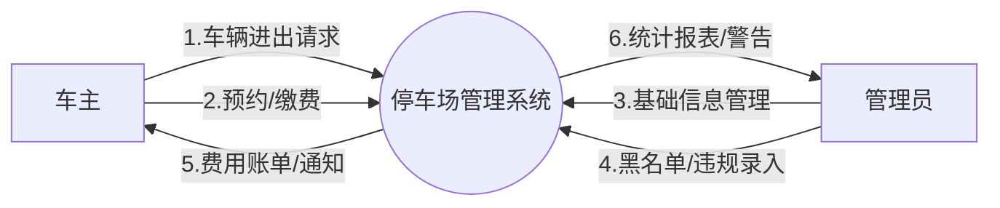
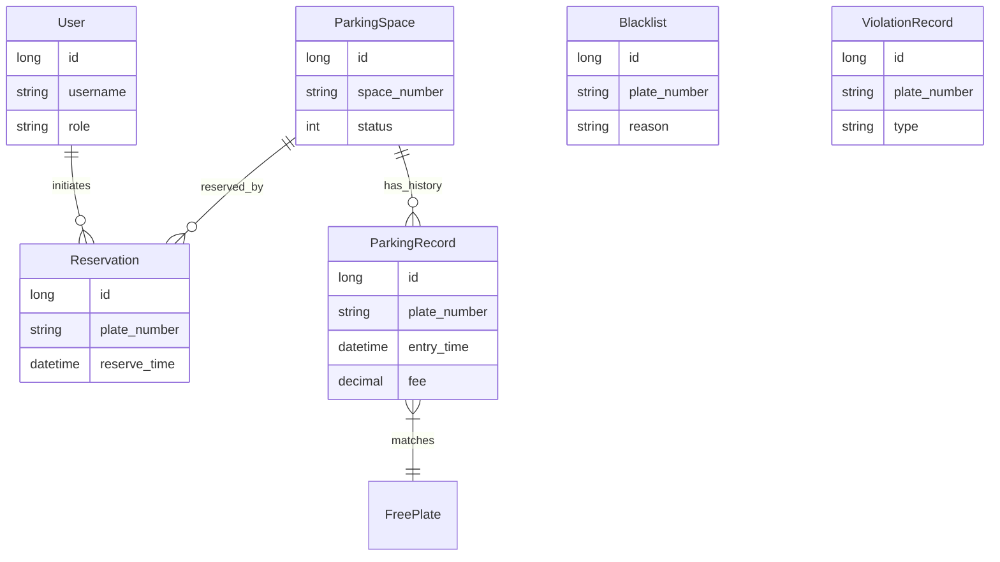

# 数据库应用系统课程设计报告 - 停车场管理系统

## 1 需求分析

### 1.1 需求分析概述
随着城市车辆保有量的急剧增加，传统的人工停车管理模式已难以满足高效、准确、实时的管理需求。本系统旨在开发一套基于Web的现代化停车场管理系统，服务于**系统管理员**和**普通车主**两类用户。
**系统预期功能**：
1.  **基础管理**：实现用户（管理员/车主）的注册、登录及权限划分；实现车位资源的数字化管理（增删改查）。
2.  **核心业务**：
    *   **入场管理**：自动记录车辆入场时间，强制校验车辆是否在黑名单中或是否存在未支付的历史订单，若存在则拒绝入场。
    *   **出场计费**：根据入场时间自动计算停车时长和费用（支持免费车牌逻辑），更新车位状态为“空闲”。
    *   **预约服务**：车主可在线查看空闲车位并进行预约，系统在车辆实际入场时自动关联预约记录。
3.  **安全管控**：管理员可登记车辆违规行为，并对严重违规或长期欠费车辆实施黑名单管理，系统自动拦截黑名单车辆。

### 1.2 最高层数据流图

*描述*：
*   **输入流**：车辆信息（车牌）、用户操作（预约、缴费）、管理员操作（录入黑名单、管理车位）。
*   **处理逻辑**：停车场管理系统。
*   **数据流**：
    *   管理员 -> 系统：车位信息、黑名单信息、违规记录。
    *   用户 -> 系统：预约请求、缴费信息、车辆进出请求。
    *   系统 -> 管理员：统计报表、违规警告。
    *   系统 -> 用户：费用账单、预约凭证、车位状态。

### 1.3 各子系统的数据流图
1.  **车辆入场子系统**：
    *   输入：车牌号码。
    *   处理：查询黑名单表 -> 查询未支付记录表 -> 查询预约表 -> 生成停车记录 -> 更新车位状态。
    *   输出：入场通知/拒绝原因。
2.  **车辆出场/计费子系统**：
    *   输入：车位ID。
    *   处理：读取入场记录 -> 计算时长 -> 匹配免费车牌表 -> 计算费用 -> 更新停车记录（费用、出场时间） -> 释放车位。
    *   输出：缴费通知单。

## 2 概念结构设计

### 2.1 子系统E-R图
*   **用户模块**：实体 `User` (属性：ID, 用户名, 密码, 角色)。
*   **车位模块**：实体 `ParkingSpace` (属性：ID, 车位号, 状态, 备注)。
*   **业务模块**：
    *   实体 `ParkingRecord` (属性：ID, 车牌, 入场时间, 出场时间, 费用)。
    *   实体 `Reservation` (属性：ID, 车牌, 预约时间)。
    *   实体 `Blacklist` (属性：ID, 车牌, 原因)。

### 2.2 系统整体E-R图

*   **关系描述**：
    *   `User` 与 `Reservation` 是一对多关系（一个用户可多次预约）。
    *   `ParkingSpace` 与 `Reservation` 是一对多关系（一个车位可被多次预约）。
    *   `ParkingSpace` 与 `ParkingRecord` 是一对多关系（一个车位产生多条停车记录）。
    *   `ParkingRecord` 关联 `FreePlate`（多对一，用于计费规则）。

## 3 逻辑结构设计和实施

### 3.1 关系模式的转换
根据概念模型，系统包含以下核心关系模式：
1.  **sys_user** (<u>id</u>, username, password, role, create_time)
2.  **parking_space** (<u>id</u>, space_number, status, remark)
3.  **parking_record** (<u>id</u>, plate_number, space_id, entry_time, exit_time, fee, status, payment_status)
    *   外键：space_id -> parking_space(id)
4.  **reservation** (<u>id</u>, user_id, space_id, plate_number, reserve_time, status)
    *   外键：user_id -> sys_user(id), space_id -> parking_space(id)
5.  **blacklist** (<u>id</u>, plate_number, reason, create_time)
6.  **free_plate** (<u>id</u>, plate_number, description)
7.  **violation_record** (<u>id</u>, plate_number, violation_type, description, record_time)

### 3.2 关系模式的优化
系统所有关系模式均满足 **第三范式 (3NF)**：
*   **1NF**：所有字段均为原子值，不可再分。
*   **2NF**：主键均为单列 ID，不存在非主属性对主键的部分依赖。
*   **3NF**：不存在非主属性对主键的传递依赖。例如，`parking_record` 中直接存储 `fee` 而非只存时长，虽然 `fee` 可由时长计算得出，但考虑到费率可能随时间调整，为了保证历史账单的不可变性，将费用固化存储符合业务需求，且不违反 3NF 关于依赖传递的定义（此时 Fee 依赖于“特定时刻的费率规则”，这通常不作为表内字段）。

### 3.3 设计用户子模式
系统设计了基于角色的访问控制 (RBAC) 视图：
*   **管理员视图 (Admin View)**：拥有对 `sys_user`, `blacklist`, `free_plate`, `violation_record` 的全量读写权限，以及对 `parking_space` 的管理权限。
*   **普通用户视图 (User View)**：仅拥有对 `parking_space` 的只读权限（查看状态），以及对 `reservation` 表中属于自己记录的读写权限。

### 3.4 设计存储过程
为了实现“计算停车费用”的数据库层封装，设计如下存储过程（示例）：
```sql
CREATE PROCEDURE CalculateParkingFee(IN recordId BIGINT, OUT parkingFee DECIMAL(10,2))
BEGIN
    DECLARE entryTime TIMESTAMP;
    DECLARE exitTime TIMESTAMP;
    DECLARE durationHours INT;
    
    SELECT entry_time, exit_time INTO entryTime, exitTime 
    FROM parking_record WHERE id = recordId;
    
    -- 计算小时数（向上取整）
    SET durationHours = CEIL(TIMESTAMPDIFF(MINUTE, entryTime, exitTime) / 60.0);
    
    -- 基础费率 5元/小时
    SET parkingFee = durationHours * 5.00;
    
    UPDATE parking_record SET fee = parkingFee WHERE id = recordId;
END;
```
*(注：实际项目中该逻辑在 Java Service 层实现以获得更好的跨平台性，此处为满足课程设计要求的数据库层实现示例)*

### 3.5 设计触发器
为了保证数据完整性，设计触发器：当车辆入场产生记录时，自动将车位状态更新为“占用”。
```sql
CREATE TRIGGER AfterEntryInsert
AFTER INSERT ON parking_record
FOR EACH ROW
BEGIN
    UPDATE parking_space 
    SET status = 1 
    WHERE id = NEW.space_id;
END;
```

### 3.6 SQL代码实现
```sql
-- 1. 用户表
CREATE TABLE sys_user (
    id BIGINT AUTO_INCREMENT PRIMARY KEY,
    username VARCHAR(50) NOT NULL,
    password VARCHAR(100) NOT NULL,
    role VARCHAR(20) DEFAULT 'USER',
    create_time TIMESTAMP DEFAULT CURRENT_TIMESTAMP
);

-- 2. 停车位表
CREATE TABLE parking_space (
    id BIGINT AUTO_INCREMENT PRIMARY KEY,
    space_number VARCHAR(20) NOT NULL,
    status INT DEFAULT 0, -- 0-空闲, 1-占用, 2-已预约
    remark VARCHAR(200)
);

-- 3. 停车记录表
CREATE TABLE parking_record (
    id BIGINT AUTO_INCREMENT PRIMARY KEY,
    plate_number VARCHAR(20) NOT NULL,
    space_id BIGINT NOT NULL,
    entry_time TIMESTAMP NOT NULL,
    exit_time TIMESTAMP,
    fee DECIMAL(10, 2),
    status INT DEFAULT 0, -- 0-停车中, 1-已出场
    payment_status INT DEFAULT 0, -- 0-未支付, 1-已支付
    FOREIGN KEY (space_id) REFERENCES parking_space(id)
);

-- 4. 免费车牌表
CREATE TABLE free_plate (
    id BIGINT AUTO_INCREMENT PRIMARY KEY,
    plate_number VARCHAR(20) NOT NULL UNIQUE,
    description VARCHAR(200)
);

-- 5. 预约记录表
CREATE TABLE reservation (
    id BIGINT AUTO_INCREMENT PRIMARY KEY,
    user_id BIGINT NOT NULL,
    space_id BIGINT NOT NULL,
    plate_number VARCHAR(20) NOT NULL,
    reserve_time TIMESTAMP DEFAULT CURRENT_TIMESTAMP,
    status INT DEFAULT 0, -- 0-有效, 1-已使用, 2-已取消
    FOREIGN KEY (user_id) REFERENCES sys_user(id),
    FOREIGN KEY (space_id) REFERENCES parking_space(id)
);

-- 6. 黑名单表
CREATE TABLE blacklist (
    id BIGINT AUTO_INCREMENT PRIMARY KEY,
    plate_number VARCHAR(20) NOT NULL UNIQUE,
    reason VARCHAR(200),
    create_time TIMESTAMP DEFAULT CURRENT_TIMESTAMP
);

-- 7. 违规记录表
CREATE TABLE violation_record (
    id BIGINT AUTO_INCREMENT PRIMARY KEY,
    plate_number VARCHAR(20) NOT NULL,
    violation_type VARCHAR(50) NOT NULL,
    description VARCHAR(200),
    record_time TIMESTAMP DEFAULT CURRENT_TIMESTAMP
);
```

## 4 系统概要设计
系统采用 B/S (Browser/Server) 架构，后端基于 Spring Boot 框架，采用经典的 MVC 分层设计模式。
**功能模块图**：
*   **停车场管理系统**
    *   **用户模块**：登录、注册、个人中心。
    *   **车位模块**：车位展示、车位状态管理、车位CRUD（管理员）。
    *   **业务模块**：车辆入场、车辆出场、费用支付、预约管理。
    *   **风控模块**：黑名单管理、违规记录、免费车牌设置。

**核心业务流程**：
1.  **入场流程**：用户请求入场 -> 系统校验黑名单 -> 校验未支付账单 -> 校验预约信息 -> 通过校验 -> 写入入场记录 -> 变更车位状态为占用。
2.  **出场流程**：用户请求出场 -> 系统计算时长 -> 匹配免费规则 -> 生成账单 -> 用户支付 -> 写入出场时间 -> 变更车位状态为空闲。

## 5 系统详细设计

### 5.1 开发环境与技术栈
*   **操作系统**：Windows 10/11
*   **开发语言**：Java (JDK 1.8)
*   **开发框架**：Spring Boot 2.7.18
*   **数据库**：H2 Database (In-Memory 模式) / MySQL 8.0
*   **前端技术**：Thymeleaf 模板引擎 + Bootstrap 5 UI 框架
*   **开发工具**：IntelliJ IDEA / VS Code

### 5.2 核心模块实现
**1. 车辆入场核心代码 (`ParkingService.java`)**
```java
@Transactional
public void vehicleEntry(Long spaceId, String plateNumber) {
    // 1. 黑名单校验
    Blacklist bl = blacklistMapper.findByPlateNumber(plateNumber);
    if (bl != null) {
        throw new RuntimeException("拒绝入场: 车辆已被列入黑名单 (" + bl.getReason() + ")");
    }

    // 2. 欠费校验
    List<ParkingRecord> unpaid = parkingRecordMapper.findUnpaidByPlateNumber(plateNumber);
    if (!unpaid.isEmpty()) {
        throw new RuntimeException("车辆 " + plateNumber + " 存在未支付订单，请先完成支付。");
    }

    // 3. 预约匹配逻辑
    ParkingSpace space = parkingSpaceMapper.findById(spaceId);
    if (space.getStatus() == 2) { // 若车位为预约状态
        Reservation res = reservationMapper.findActiveBySpaceId(spaceId);
        if (res == null || !res.getPlateNumber().equals(plateNumber)) {
            throw new RuntimeException("该车位已被其他车辆预约");
        }
        res.setStatus(1); // 标记预约已使用
        reservationMapper.updateStatus(res);
    }

    // 4. 更新车位状态与插入记录
    space.setStatus(1); // 1=占用
    parkingSpaceMapper.updateStatus(space);
    
    ParkingRecord record = new ParkingRecord();
    record.setSpaceId(spaceId);
    record.setPlateNumber(plateNumber);
    record.setEntryTime(new Date());
    parkingRecordMapper.insert(record);
}
```

### 5.3 界面设计
(请在此处粘贴系统截图，建议包含：登录页、控制台Dashboard、黑名单拦截警告框、缴费页面)

## 6 系统测试

| 测试用例ID | 测试场景 | 输入数据 | 预期结果 | 实际结果 | 测试结论 |
| :--- | :--- | :--- | :--- | :--- | :--- |
| **TC-01** | 正常车辆入场 | 车位:A001, 车牌:京A88888 | 提示入场成功，车位变红(占用) | 与预期一致 | 通过 |
| **TC-02** | 黑名单车辆入场 | 车位:A002, 车牌:BLACK-001 | 弹出红色警告“拒绝入场：车辆已被列入黑名单” | 与预期一致 | 通过 |
| **TC-03** | 欠费车辆再入场 | 车位:A003, 车牌:京A88888(有未付订单) | 提示“存在未支付订单，请先完成支付” | 与预期一致 | 通过 |
| **TC-04** | 车辆出场计费 | 车位:A001, 停车2小时 | 显示费用 10.00 元 | 与预期一致 | 通过 |
| **TC-05** | 免费车牌出场 | 车位:B001, 车牌:FREE-001 | 显示费用 0.00 元，状态自动变更为已支付 | 与预期一致 | 通过 |

## 7 心得体会
本次课程设计是一次完整的软件工程实践。
1.  **技术收获**：深入理解了数据库设计规范（3NF）在实际项目中的应用价值；熟练掌握了 Spring Boot 与 MyBatis 的整合开发；学会了使用 Thymeleaf 进行服务器端渲染。
2.  **问题解决**：
    *   **路径问题**：在 Tomcat 部署 WAR 包时遇到 404 错误，通过引入 `SpringBootServletInitializer` 并规范化 Thymeleaf 的 `@{/url}` 路径语法解决。
    *   **数据库锁**：初期使用 H2 文件模式导致多进程文件锁冲突，后调整为 H2 In-Memory 模式，既解决了冲突又保证了测试环境的纯净。
3.  **不足与展望**：当前系统的并发处理能力有限，未来可引入 Redis 缓存热点车位数据，并利用数据库乐观锁机制解决高并发下的车位超卖问题。

## 8 参考文献
[1] 王珊，萨师煊. 数据库系统概论[M] 第6版. 高等教育出版社, 2023.
[2] 董旭阳. SQL编程思想：基于 5 种主流数据库代码实现[M]. 电子工业出版社, 2021.
[3] Spring Boot Reference Documentation. https://docs.spring.io/spring-boot/docs/current/reference/html/
[4] MyBatis 3 User Guide. https://mybatis.org/mybatis-3/zh/index.html
